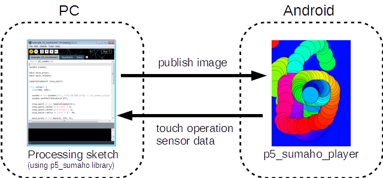

p5_sumaho
=========

p5_sumaho is Android remote control framework library for Processsing.

see also p5_sumaho_player
* https://github.com/yoggy/p5_sumaho_player

Google Play URL
  * https://play.google.com/store/apps/details?id=net.sabamiso.p5_sumaho_player

Demo Movie
=========
  * http://youtu.be/RWt1vlE57-g
  * 
  

How to use
=========

example_01_publish
--------
<pre>
import p5_sumaho.*;

Sumaho sumaho;
  
void setup() {
  size(480, 640);
  sumaho = new Sumaho(this, "192.168.1.101"); // p5_sumaho_player ip address
}

void draw() {
  // draw something
  if (frameCount % 100 == 0) {
    background(random(255), random(255), random(255));
  }

  int x = (int)random(width);
  int y = (int)random(height);
  int r = (int)random(50) + 30;

  noStroke();
  fill(random(255), random(255), random(255));
  ellipse(x, y, r, r);

  // publish to p5_smaho_player  
  sumaho.publish();
}
</pre>

example_02_touchevent
--------
<pre>
import p5_sumaho.*;

Sumaho sumaho;

void setup() {
  size(480, 640);
  sumaho = new Sumaho(this, "192.168.1.101"); // p5_sumaho_player ip address
}

void draw() {
  background(0, 0, 255);
  
  if (mousePressed) {
    fill(255, 255, 0);
    ellipse(mouseX, mouseY, 50, 50);
  }
  
  // publish to p5_smaho_player  
  sumaho.publish();
}
</pre>

example_04_sensor
--------

<pre>
import p5_sumaho.*;

Sumaho sumaho;

void setup() {
  size(480, 640);

  sumaho = new Sumaho(this, "192.168.1.101"); // p5_sumaho_player ip a
}

void draw() {
  background(0, 0, 255);

  PVector g = sumaho.getSensor().getGravity(); // accelerometer sensor value
  PVector m = sumaho.getSensor().getMagneticField(); // matnetic field sensor value
  float l = sumaho.getSensor().getLight();     // ligith sensor value
  float p = sumaho.getSensor().getProximity(); // proximity sensor value

  text("sumaho.isConnect()=" + sumaho.isConnect(), 10, 20);  
  text(String.format("gravity=(%.2f, %.2f, %.2f)", g.x, g.y, g.z), 10, 40);
  text(String.format("magnetic field=(%.2f, %.2f, %.2f)", m.x, m.y, m.z), 10, 60);
  text("light sensor=" + l, 10, 80);
  text("proximity sensor=" + p, 10, 100);

  // publish to p5_smaho_player  
  sumaho.publish();
}
</pre>

Libraries
========
p5_smaho uses the following libraries.

Protocol Buffers
* https://code.google.com/p/protobuf/

